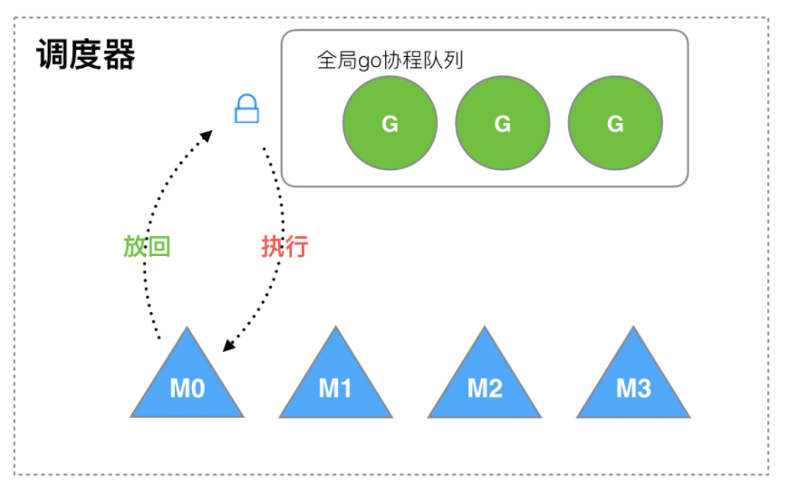
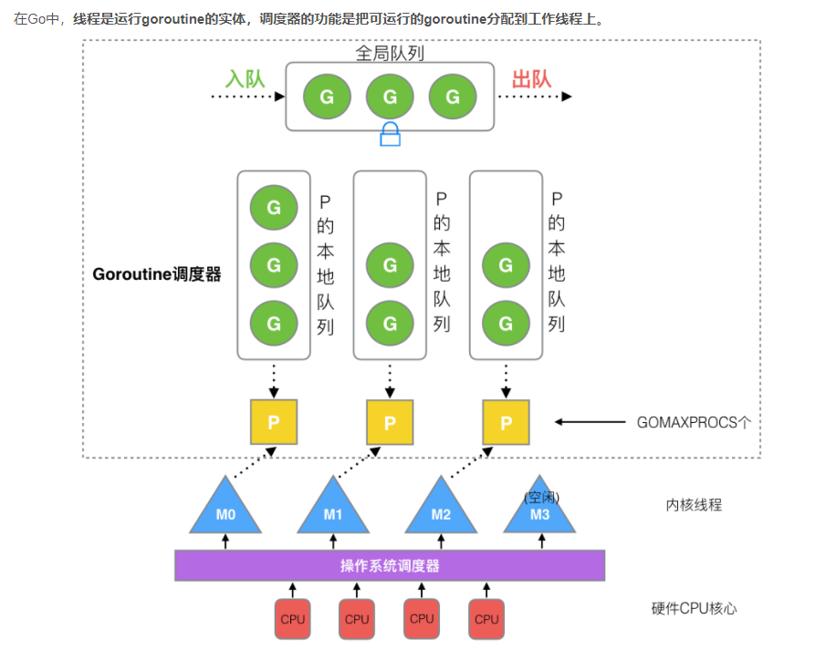
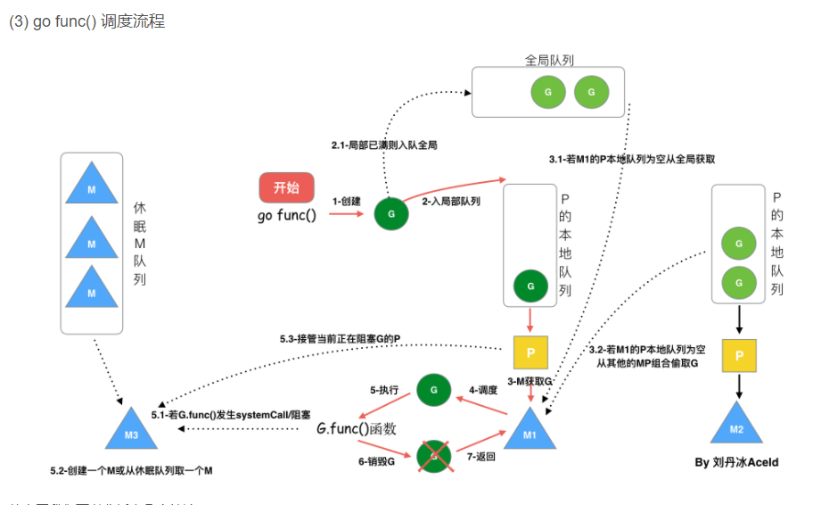

## 历史
1. cpu是出让时间片来并发执行线程，每次切换需要保存现场和切换上下文，这样非常耗费资源，导致CPU的
利用率非常低。多线程开发也会让程序设计变的更加复杂(需要考虑资源竞争等问题，比如锁 竞争冲突等)。
并且每个线程耗费的资源也比较大 64位系统一个线程最低占用 `8M` 的内存。

2. 后来工程师们发现一个线程分为 `内核态`线程 和 `用户态`线程.一个用户态线程必须要绑定一个内核态线程。
但是CPU并不知道有`用户态线程`的存在，它只知道它运行的是一个 `内核态`线程。此时大佬们就开始建立模型了:
用户态的线程叫协程(`co-routine`)，内核态的线程叫还叫线程(`thread`)。此时就有协程和线程的映射关系:
 - N:1(多个协程对应一个线程)
 - 1:1(一个协程对应一个线程)
 - M:N(M个协程绑定N个线程)，克服了上面的缺点，但是设计起来比较负责
 
## goroutine
goroutine 采用的是 M:N 的模型
### 优点
 - 占用内存更小(几KB)
 - 调度更灵活(runtime调度)
 
### 第一代调度器

 
 
 M想要执行、放回G都必须访问全局G队列，并且M有多个，即多线程访问同一资源需要加锁进行保证互斥/同步，所以全局G队列是有互斥锁进行保护的。
 
#### 第一代调度器的缺点
 1. 创建、销毁、调度G都需要每个M获取锁，这就形成了 `激烈的锁竞争`.
 2. M转移G会造成 `延迟和额外的系统负载`, 比如当G中包含创建新协程的时候，M创建了 G，为了继续
 执行G，需要把G交给M执行，也造成了`很差的局部性`, 因为G和G是相关的，最好放在M上执行，而不是其它M
 3. 系统调用(CPU在M之间切换)导致频繁的线程阻塞和取消阻塞操作增加了系统开销
 

### 最新调度器
面对之前调度器的问题，Go设计了新的调度器。

在调度器中，除了 M(thread)和G(goroutine)，又引进了 P(processor).

P(processor)包含了运行 goroutine 的资源, 如果线程想运行 goroutine, 必须先获取P, P中还包含了可运行的G队列。

#### GMP模型的简单介绍
线程是运行 goroutine 的实体,调度器的功能是把可运行的 goroutine 分配到工作线程上。

 1. 全局队列: 存放等待运行的G
 2. P的本地队列: 同全局队列类似, 存放的也是等待运行的G，存的数量有限，不超过256个。
 新建G时，G优先加入到P的本地队列，如果队列满了，则会把本地队列中一半的G移动到全局队列。
 3. P列表: 所有的P都在程序启动时创建，并保存在数组中，最多 GOMAXPROCS 个。
 4. M: 线程想运行任务就得获取P，从P的本地队列获取G，P为空时，会尝试从全局队列中拿一批G，放到它绑定的P中，或从
 其它P中偷一半放到自己P的本地队列
 
> goroutine 调度器 和 OS调度器是通过M结合起来的，每个M都代表了 1 个内核线程，OS调度器负责把
>内核线程分配到 CPU 的核上执行。

#### 关于 P 和 M的数量
 1. P的数量: 
 由启动时环境变量 $GOMAXPROCS 或者是由 runtime 的方法 GOMAXPROCS() 决定。这意味着在程序
 执行的任意时刻都只有 $GOMAXPROCS/GOMAXPROCS() 个 goroutine 在同时运行。
 2. M的数量: 
 go 语言本身的限制: go程序启动时，会设置 M 的最大数量，默认10000(当然内核不可能支持这么多个)。
 一个M阻塞了，会创建新的M
 
#### 调度器的设计策略
 1. 复用线程: 避免频繁的创建、销毁线程，而是对线程的复用
    + work stealing机制: 当本地线程无可运行的G时，尝试从其他线程绑定的P偷取G，而不是销毁线程
    + hand off机制: 当本线程因为G进行系统调用阻塞时，线程释放绑定的P,把P转移给其他空闲的线程执行。

 2. 利用并行: 最有有 $GOMAXPROCS 个线程在CPU内核上运行。
 3. 抢占: 在 go中，一个 goroutine 最多占用 CPU 10ms,防止其它 goroutine 被饿死
 
