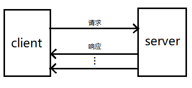

## 完整代码
[https://github.com/wanmei002/grpc-learn/tree/master/ch02](https://github.com/wanmei002/grpc-learn/tree/master/ch02)

## 服务端流的简短介绍
在一元 RPC 模式中，gRPC服务端和gRPC客户端在通信时始终只有一个请求和一个响应。

在服务端流 RPC 模式中，服务端在接收到客户端的请求消息后，会发回一个响应的序列(好几个响应). 
这种多个响应所组成的序列也被称为流。在将所有的服务器端响应发送完毕之后，
服务端会以 trailer 元数据的形式将其状态发送给客户端，从而标记流的结束。



## proto 文件中声明流
```proto
service OrderManagement {
    rpc SearchOrders(google.protobuf.StringValue) returns (stream Order);
}
```
> 关键字 `stream` 来声明返回的数据是流

## 生成代码
` protoc --go_out=plugins=grpc:server/product proto/product.proto `

## 服务端代码编写
###  实现 SearchOrders 方法
```go 

func (s *server) SearchOrders(searchQuery *wrappers.StringValue,
	stream product.OrderManagement_SearchOrdersServer) error {
	
	for _, order := range m { // m 是一个切片，保存了 order 集合
		for _, item := range order.Items {
			if strings.Contains(item, searchQuery.Value) {
				err := stream.Send(&order) // 流的发送
				if err != nil {
					fmt.Println("server stream send failed; err:", err)
					return err
				}
				fmt.Println("fond " + searchQuery.Value)
				break
			}
		}
	}
	return nil // 流的结束
}
```
### 跑起来

```go 
    ls, err := net.Listen("tcp", ":8903")
	if err != nil {
		fmt.Println("listen failed; err:", err)
		return
	}

	g := grpc.NewServer()

	product.RegisterOrderManagementServer(g, &server{}) // 注册服务

	fmt.Println("start service")

	if err = g.Serve(ls); err != nil {
		fmt.Println("server start failed; err:", err)
	}
```

## 客户端代码编写
```go 
func main() {
	conn, err := grpc.Dial(":8903", grpc.WithInsecure())
	if err != nil {
		fmt.Println("client dial failed; err :", err)
		return
	}

	defer conn.Close()

	c := product.NewOrderManagementClient(conn)

	searchStream, err := c.SearchOrders(context.Background(), &wrappers.StringValue{Value: "zzh"})
	if err != nil {
		fmt.Println("client grpc failed; err :", err)
		return
	}

	for {
		order, err := searchStream.Recv()// 流数据的接收
		if err != nil {
			if err == io.EOF { // 流数据结束
				fmt.Println("stream end")
				return
			}
			fmt.Println("clinet recv failed; err :", err)
			return
		}

		fmt.Printf("recv order info : %+v\n", order)
	}
}
```


