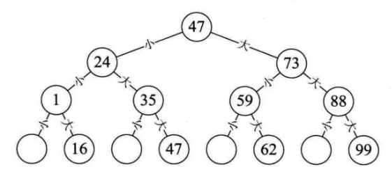
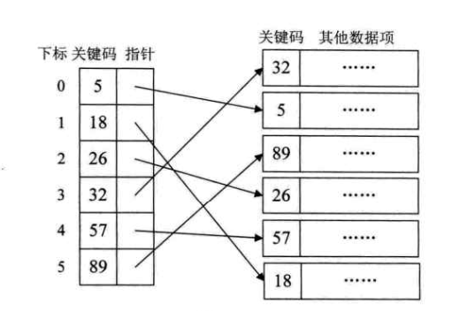
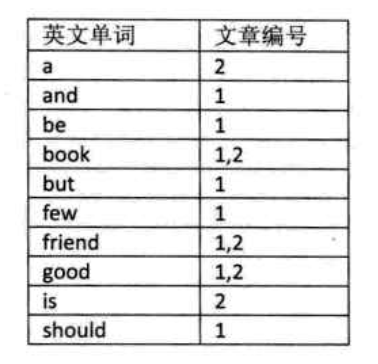
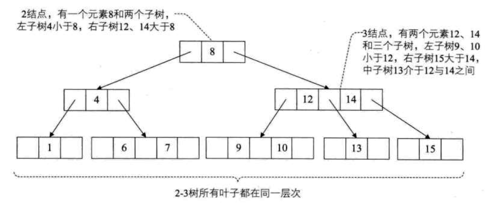

#### 二分查找
 - code 
    ```C
    int Binary_Search(int *a, int n, int key)
    {
        int low, high, mid;
        low=1;
        high=n;
        while(low <= high)
        {
            mid = (low + high)/2;
            if (key < a[mid])
                high = mid - 1;
            else if (key > a[mid])
                low = mid +1;
            else
                return mid;
        }
        return 0;
    }
    ```
    
 - 
    
    
#### 插值查找
 - 如果序列里的数字是均匀分布的(数字间的间隔是大约一样的), 则插值查找比较快
 - 插值算法推导
    + 二分查找 mid = (low + high) / 2 -> mid= low + (high-low)/2, 因为是均匀分布的
    + 改进 : mid = low + ((key-a[low])*(high-low))/(a[high]-a[low])
    
 - 斐波那契查找  `稍后过来看看`
    + 
    
    
#### 线性索引查找
##### 稠密索引
 - 稠密索引是指在线性索引中, 将数据集中的每个记录对应一个索引项, 对于密稠索引这个索引表来说, 索引项一定是按照关键码有序的排列
 
 
 
 
##### 分块索引
 - 分块有序, 是把数据集的记录分成了若干块, 并且这些块需要满足两个条件:
    + 块内无序(当然块内有序最好)
    + 块间有序
 - 块的结构 : 保存有最大关键码, 块长, 块首指针
 
 
#### 倒排索引
 - 键是关键字, 值是数据编号  
 
 
 
 
#### 二叉排序树
##### 二叉排序树(binary sort tree), 又称为二叉查找树。 它或者是一棵空树, 或者是具有下列性质的二叉树
 - 若它的左子树不空, 则左子树上所有结点的值均小于它的根结构的值
 - 若它的右子树不空, 则右子树上所有结点的值均大于它的根结构的值
 - 它的左、右子树也分别为二叉排序树
 > 构造一棵二叉排序树的目的其实并不是为了排序, 而是为了提高查找和插入删除关键字的速度
 
##### 二叉排序树代码实现
```C
// 数据结点实现
typedef struct BiTNode
{
    int data;
    struct BiTNode *lchild, *rchild;
} BiTNode, *BiTree;

// 查找方法
Status SearchBST(BiTree T, int key, BiTree f, BiTree *p)
{
    if (!T) {
        *p = f;
         return FALSE;
    } else if (key == T->data) {
       *p = T;
       return TRUE; 
    } else if (key < T->data) {// 左子树查找
        return SearchBST(T->lchild, key, T, p);
    } else {// 右子树查找
        return SearchBST(T->child, key, T, p);
    }
}
// 插入操作
Status InserBST(BiTree *T, int key)
{
    BiTree p, s;
    // 先查找 没有的话再插入 
    if (!SearchBST(*T, key, NULL, &p)) {
        s = (BiTree)malloc(sizeof(BiTNode));
        s->data = key;
        s->lchild = s->rchild = NULL;
        if (!p)
            *T = s;
        else if (key < p->data)
            p->lchild = s;
        else
            p->rchild = s;
    } else {
        return FALSE;// 二叉树中有这个值 则不插入
    }
}

// 构建二叉排序树
int i;
int a[10] = {1,2,3,4,5,6,7,8,9,10};
BiTree T=NULL;
for (i=0; i<10; i++) {
    InsertBST(&T, a[i]);
}


// 删除二叉排序树结点
Status DeleteBST(BiTree *T, int key)
{
    if (!*T) {
        return FALSE;
    } else {
        if (key == (*T)->data) {
            retrun Delete(T)
        } else if (key < (*T)->data) {
            return DeleteBST(&(*T)->lchild, key)
        } else {
            return DeleteBST(&(*T)->rchild, key)
        }
    }
}
// 从二叉排序树中删除结点P, 并重接它的左或右子树
Status Delete(BiTree *p)
{
    BiTree q,s;
    if ((*p)->lchild == NULL) {/* 左子树为空 直接右子树续接 */
       q = *p; *p = (*p)->rchild;
       free(q);
    } else if ((*p)->rchild = NULL) {
        q=*p; *p = (*p)->lchild; free(q);
    } else {/* 左右子树均不空 */
        q = *p; s = (*p)->lchild;
        while (s->rchild) {/* 找左子树的最大值 */
            q = s; s = s->rchild;
        }
        (*p)->data = s->data;
        if (q!=*p)
            q->rchild = s->lchild;
        else
            q->lchild = s->lchild;
            
        free(s);
    }
    return TRUE;
}
```

#### 平衡二叉树
##### 概念
平衡二叉树是一种二叉排序树, 其中每一个节点的左子树和右子树的高度差至多等于1; 我们将
二叉树上结点的左子树深度减去右子树深度的值称为平衡因子BF, 那么平衡二叉树的BF为 (-1, 0 ,1)


#### 多路查找树
##### 概念
多路查找树: 其每一个结点的孩子数可以多于两个, 且每一个结点处可以存储多个元素

##### 2-3树
 - 2-3树是这样的一棵多路查找树: 其中每一个结点都具有两个孩子(我们称它为2结点)或三个孩子(我们称它为3结点)
    + 一个2结点包含一个元素和两个孩子(或没有孩子)\[要么没有, 要么有2个孩子\], 其他的跟二叉排序树一样
    + 一个3结点包含一小一大两个元素和三个孩子(或没有孩子), 一个 3 结点要么没有孩子, 要么具有3个孩子. 如果某个3结点有孩子的话，
    左子树包含小于较小元素的元素, 右子树包含大于较大元素的元素, 中间子树包含介于两元素之间的元素
    + 2-3树中所有的叶子都在同一层次上
    
    
    
    
##### B树
 - B树(B-tree) 是一种平衡的多路查找树, 2-3 和 2-3-4都是B树的特例, 结点最大的孩子数目称为B树的阶(order)
 一个 m 阶的B树具有如下属性:
    + 如果根结点不是叶子结点则其至少有两棵子树
    + 每一个非根的分支结点都有K-1个元素和K个孩子, 其中\[m/2\]<=k<=m, 每一个叶子结点 N 都有K-1个元素
 
 