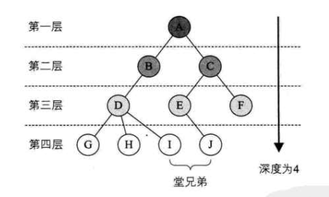
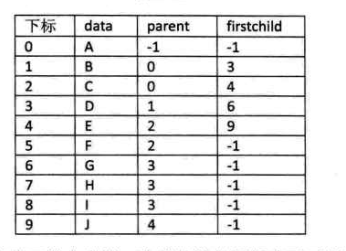

### 二叉树
#### 度, 每个结点的度是这个结点的子节点个数, 数的度是树内各结点的度的最大值
 - 节点拥有的子树数称为节点的度。 度为 0 的节点称为叶结点(leaf)或终端结点
 - 度不为 0 的结点称为非终端结点或分支结点，除根结点之外, 分支结点也称为内部结点
 - 数的度是树内各结点的度的最大值  
 
 
 
 
#### 树的其它相关概念
 - 结点的层次(level)从根开始定义起, 根为第一层, 根的孩子为第二层, 其双亲在同一层的结点互为堂兄弟, 树中结点的最大层次称为树的深度(depth)或高度
 - 
 
#### 树的存储结构
 - 双亲表示法
    + 数据结构, 用数组保存
    ```C
    #define MAX_TREE_SIZE 100
    typedef int TElemType;/* 树结点的数据类型, 目前暂定为整型 */
    typedef struct PTNode /* 结点结构 */
    {
        TElemType data; /* 结点数据 */
        int parent; /* 双亲位置 */
    } PTNode;
    
    typedef struct
    {
        PTNode nodes[MAX_TREE_SIZE]; /* 结点数组 */
        int r, n; /* 根的位置和结点数 */
    } PTree;
    ```
    
 
    + 这样可以找到结点的根, 但是找不到结点的 child 结点, 优化如下
        - 在结点的数据结构中加一个属性 child, 指向child 的下标  
        
        
    + 另外一个问题场景, 我们很关注各兄弟之间的关系, 可以增加一个右兄弟属性来体现兄弟关系
    
    
    
    > 存储结构设计是一个非常灵活的过程。一个存储结构设计得是否合理, 取决于基于该存储结构的运算是否合适、是否方便, 时间复杂度好不好等
 - 孩子表示法
    + 结点的数据结构
        - 每个结点的指针空间是树的度
    
        | data | child1 | child2 | child3 | ··· | childd |
        | ---- | ---- | ---- | ---- | ---- | ---- |
    
        
            + 如果各个结点的度不一样, 则很浪费空间
            
        - 每个结点的指针空间是这个结点的度, 这种方法克服了浪费空间的缺点, 对空间利用率很高了  
        
        但是由于各个结点的链表是不相同的结构, 加上要维护结点的度的数值, 在运算上就会带来时间上的损耗
        
    + 为了要遍历整棵树, 把每个结点放到一个顺序存储的数组中是合理的, 但每个结点的孩子有多少是不确定的, 所以我们再对每个结点的孩子建立一个单链表体现它们的关系
    
        
        
 - 特殊二叉树
    + 斜树: 所有结点都只有左子树的二叉树叫左斜树, 所有结点都只有右子树叫右斜树
    + 满二叉树: 在一棵二叉树中, 如果所有分支结点都存在左子树, 并且所有叶子都在同一层上, 这样的二叉树称为满二叉树
    + 完全二叉树: 对于一棵具有 n 个结点的二叉树按层序编号, 如果编号为 i(1 <= i <= n) 的结点与同样深度的满二叉树中编号为 i 的结点在二叉树中位置
    完全相同, 则这棵二叉树称为完全二叉树  
    
    
    
    + 下面的为非完全二叉树  --- 编号中间出现空挡, 说明不是完全二叉树
    
    
    
    
 - 二叉树性质
    + 在二叉树的第 i 层上至多有 2^(i-1) 个结点(i >= 1)
    + 深度为 K 的二叉树至多有 (2^k) -1 个结点 (k >= 1)
    + 对于任何一棵二叉树T, 如果其终端结点数为n<sub>0</sub>, 度为2的结点数为n<sub>2</sub>,则n<sub>0</sub>=n<sub>2</sub>+1
    + 具有 n 个结点的完全二叉树深度为 log<sub>2</sub>n+1
    + 如果对一棵有 n 个结点的完全二叉树(其深度为 log<sub>2</sub>n+1) 的结点按层序编号(从第一层到第 log<sub>2</sub>n+1 层, 每层从左到右), 对任一结点
    i (1<= i <=n)有:
        - 如果 i=1, 则结点 i 是二叉树的根, 无双亲, 如果 i>1, 则其双亲是结点 i/2 
        - 如果 2i>n 则结点 i
    
    
 