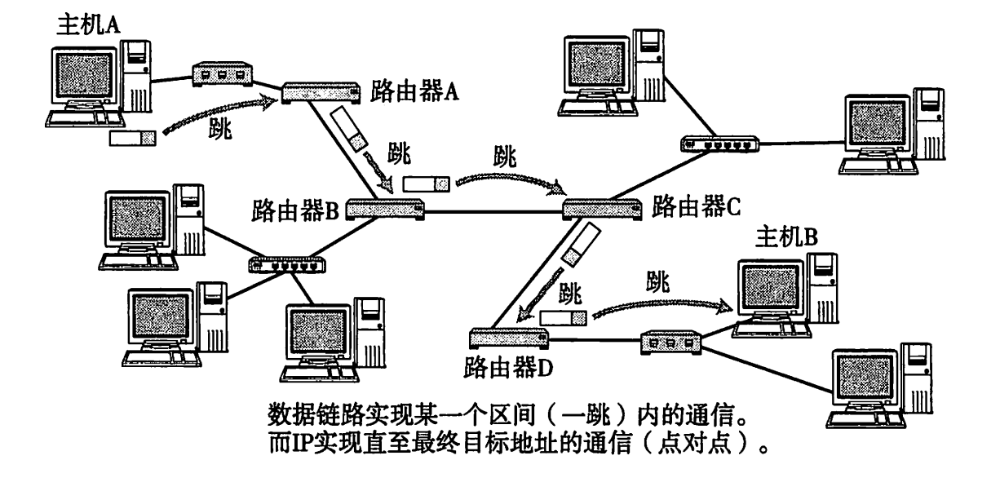
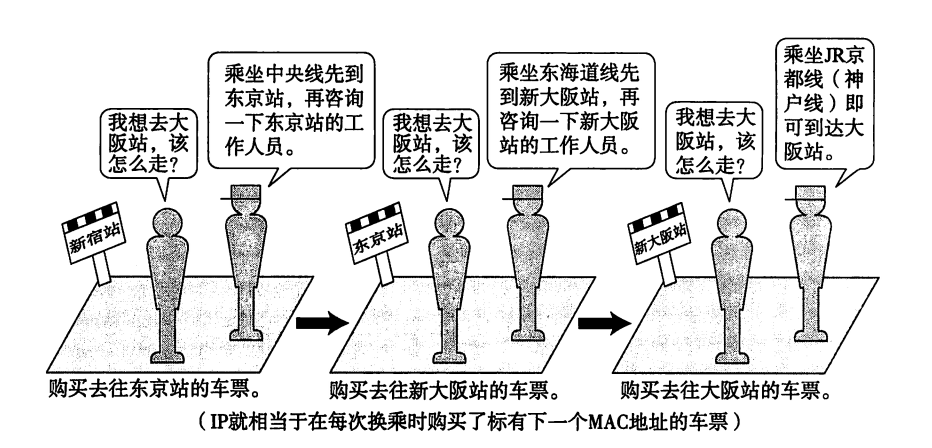
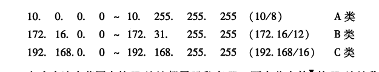
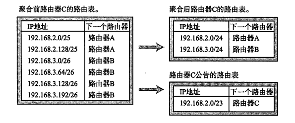
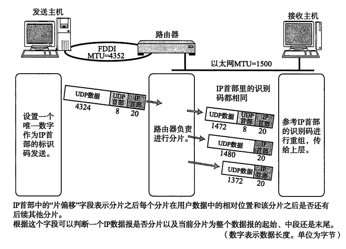

> 本文内容来自 《图解TCP/IP》 一书，支持作者，请购买正版图书

### 协议
在计算机网络与信息通信领域里, 人们经常提及`协议`一词。互联网中常用的具有代表性的协议有IP、TCP、HTTP等。而 `LAN(局域网)` 中常用的协议有 `IPX/SPX` 等

计算机必须用相同的协议才能通信，解析通信的内容

#### 分组交换协议
分组交换是指将大数据分割为一个一个叫做包(packet)的较小单位进行传输的方法

计算机通信也会在每一个分组中附加上源主机地址和目标主机地址送给通信线路。这些发送端地址、接收端地址以及分组序号写入的部分称为 `报文首部`

一个较大的数据被分为多个分组时, 为了标明是原始数据中的哪一部分，就有必要将分组的序号写入包中。接收端会根据这个序号，再将每个分组按照序号重新装配为原始数据

#### 协议的标准化
由于各个厂商采用的协议不同，不能互相通信，导致沟通不通畅。此时 ISO(国际标准化组织)制定了一个国际标准OSI, OSI协议并没有得到普及，但是 OSI参考模型却常被用于网络协议的制定当中

TCP/IP并非 ISO 所制定的某种国际标准。 而是由 `TETF` 组织所建议的、致力于推进其标准化作业的一种协议 

### 七层模型
#### 应用层
该协议会在所要传送数据的前端附加一个首部(标签)信息，信息里包含了要发送的内容

#### 表示层
将数据从 `某个计算机特定的数据格式` 转换为 `网络通用的标准数据格式(编码)`后再发出去, 表示层与表示层之间为了识别编码格式也会附加首部信息

#### 会话层
采用何种连接发送数据，也会在数据前端附加首部或标签信息后转发给下一层

#### 传输层
主机A确保与主机B之间的通信并准备发送数据，这一过程叫做 `建立连接`, 此外当通信传输结束后, 有必要将连接断开

如上，建立连接或断开连接的处理，在两个主机之间创建逻辑上的通信连接即是传输层的主要作用。此外，传输层为确保传输数据到达目的地址，
会在通信两端的计算机之间进行确认，如果数据没有到达，它会负责进行重发，保证数据的可靠性是传输层的一个重要作用。为了确保可靠性，
在这一层也会为所要传输的数据附加首部以识别这一分层的数据

#### 网络层
网络层的作用是在网络与网络相互连接的环境中，将数据从发送端主机发送到接收端主机

#### 数据链路层
通过传输介质互连的设备之间进行数据处理  像网桥 二层交换机就是工作在这一层

#### 物理层
将数据 0 1 转换为电压和脉冲光传输给物理的传输介质，而相互直连的设备之间使用地址实现传输，这种地址被称为 MAC 地址, 也可称为物理地址或硬件地址
. 采用 MAC,目的是为了识别连接到同一个传输介质上的设备。因此，在这一层中将包含MAC地址信息的首部附加到从网络层转发过来的数据，将其发送到网络。

> 每个分层上的协议规定了该分层中数据首部的格式以及首部与处理数据的顺序

#### 面向有连接型和面向无连接型
TCP 这样就是有连接型 需要建立连接后才能通信
UDP 就是无连接型 不需要知道目标地址是否存在 或是否收取信息，只管发送

#### 电路交换与分组交换
##### 电路交换
电路交换技术的历史相对久远，主要用于过去的电话网。

数据传输线路是抢占式的，占有线路的计算机传输完成了，其它计算机才能传输数据

##### 分组交换
分组交换技术是一种较新的通信方式, TCP/IP 正是采用了分组交换技术

连接通信电路的计算机将所要发送的数据分成多个数据包

分组交换的大致处理过程: 发送端计算机将数据分组发送给路由器, 路由器收到这些分组数据以后，缓存到自己的缓冲区，然后再转发给目标计算机。
> 路由器接收到数据以后会按照顺序缓存到相应的队列当中，再以先进先出的顺序将它们逐一发送出去

#### 地址
TCP/IP 通信中使用 MAC 地址、IP地址、端口号等信息作为地址标识。甚至在应用层中可以将电子邮件地址作为网络通信的地址

#### 网络的构成要素
 - 网卡 : 使计算机连网的设备
 - 中继器: 从物理层上延长网络的设备
 - 网桥/2层交换机: 从数据链路层上延长网络的设备
 - 路由器/3层交换机: 通过网络层转发分组数据的设备
 - 4~7层交换机: 处理传输层以上各层网络传输的设备
 - 网关: 转换协议的设备
 
##### 网卡
 网络接口卡: 又名 网络适配器、网卡、LAN卡，任何一台计算机连接网络时，必须要使用网卡

##### 中继器
中继器是在OSI模型的第1层-物理层上延长网络的设备。又电缆传过来的电信号或光信号经由中继器的波形调整和放大再传给另一个电缆

##### 网桥/2层交换机
多台计算机使用一个网络接口可以同时与多台电脑通信，将电脑连接起来的黑盒子一开始是集线器(hub)，集线器发送信息采用广播形式，所有集线器上的设备都可以收到信息，它们可以根据数据里的MAC地址来区分是否是发送给自己的

后来随着设备的增多、数据量的增多需要更准确的发送数据，此时再集线器的基础上增加了 MAC 学习，这就是网桥

来个网桥的栗子: 
 - 主机A发送一条数据给主机B, 中间经过网桥，此时网桥B不知道那个是主机B，广播发送，主机B收到了消息，此时网桥记住了主机A主机的MAC地址并对应哪个网络和主机B的MAC地址
 - 此时主机B发送数据给主机A，经过网桥，网桥通过内部的内存表(MAC=>网络)知道了主机A是哪个网络，直接发送数据给A所在的网络， 不需要广播。 此时网桥记住了主机B的MAC地址对应哪个网络
 - 主机A发送数据给主机B就直接发送了
 
> 网桥就是组成局域网的那台设备

##### 路由器/3层交换机
路由器是在OSI模型的第3层-网络层上连接两个网络、并对分组报文进行转发的设备。
网桥是根据物理地址(MAC地址)进行处理，
而路由器/3层交换机则是根据IP地址进行处理的。由此, TCP/IP 中网络层的地址就成为了IP地址

路由器可以连接不同的数据链路。连接两个以上的以太网，或者连接一个以太网与一个FDDI。现在家里或办公室里连接互联网时所使用的宽带路由器也是路由器的一种

路由器还有分担网络负荷的作用。甚至有些路由器具备一定的网络安全功能

##### 4~7层交换机
4~7层交换机负责处理OSI模型中从传输层至应用层的数据，如果用 TCP/IP 分层模型来表述, 4~7层交换机就是以 TCP 
等协议的传输层及其上面的应用层为基础，分析收发数据，并对其进行特定的处理

实际通信当中，人们希望在网络比较拥堵的时候，优先处理像语音这类对及时性要求较高的通信请求，放缓处理像邮件或数据转发等稍有延迟也并无大碍的通信请求。
这种处理被称为宽带控制, 也是 4~7层交换机的重要功能之一

> 为了能通过同一个URL将前端访问分发到后台多个服务器上, 可以在这些服务器的前端加一个负载均衡器(LVS)。这个负载均衡器就是4~7层交换机的一种

##### 网关
网关是OSI参考模型中负责将从传输层到应用层的数据进行转换和转发的设备，他与 4~7层交换机一样都是处理传输层及以上的数据，但是网关
不仅转发数据 还负责对数据进行转换，它通常会使用一个表示层或应用层网关，在两个不能进行直接通信的协议之间进行翻译，最终实现两者之间的通信

### TCP/IP 的标准化
#### TCP/IP 的具体含义
有人可能会认为 TCP/IP 是指 TCP 与 IP 两种协议。实际生活当中有时也确实就是指这两种协议。
然而很多情况下，它只是利用IP进行通信时所必须用到的协议群的统称。
具体来说，IP/ICMP、TCP/UDP、TELNET/FTP、以及HTTP等都属于TCP/IP的协议。它们与TCP或IP的关系紧密，时互联网必不可少的组成部分

##### IP
IP 是跨越网络传送数据包，使整个互联网都能收到数据的协议。IP协议使数据能够发送到地球的另一端，这期间
它使用 IP 地址作为主机的标识

##### ICMP
IP 数据包在发送途中一旦发生异常导致无法到达对端目标地址时, 需要给发送端发送一个发生异常的通知。ICMP 就是为
这一功能而定制的。它有时也被用来诊断网络的健康状况

##### ARP
从分组数据包的IP地址中解析出物理地址(MAC地址) 的一种协议

#### 传输层
传输层最主要的功能就是能够让应用程序之间实现通信.计算机内部，通常同一时间运行着多个程序，为此，必须分清是哪些程序与
哪些程序在进行通信。识别这些应用程序的是端口号

##### TCP
TCP 是一种面向有连接的传输层协议。它可以保证两端通信主机之间的通信可达。TCP能够正确处理在传输过程中丢包、传输顺序乱掉等异常情况。
此外，TCP还能有效利用带宽，缓解网络拥堵。

然而，为了建立与断开连接，有时它需要至少7次的发包收包，导致网络流量的浪费。此外，为了提高网络的利用率，TCP协议中定义了各种各样复杂的规范，
因此不利于视频会议(音频、视频的数据量既定)等场合使用

##### UDP
UDP有别于TCP，他是一种面向无连接的传输协议。UDP不会关注对端是否真的收到了传送过去的数据，如果需要检查对端是否收到分组数据包，或者
对端是否连接到网络，则需要在应用程序中实现。
UDP常用于分组数据较少或多播、广播通信以及视频通信等多媒体领域

#### 应用层(会话层以上的分层)
TCP/IP 的分层中, 将OSI参考模型中的会话层、表示层和应用层的功能都集中到了应用程序中实现。这些功能有时由一个单一的程序实现，有时也可能会由多个程序实现。
因此，细看TCP/IP的应用程序功能会发现，它不仅实现OSI模型中应用层的内容，还要实现会话层与表示层的功能。

##### WWW
WWW(万维网)，是一种互联网上数据读取的规范。WWW中的HTTP属于OSI应用层的协议，而HTML属于表示层的协议

##### SMTP(电子邮件协议)

##### FTP(文件传输协议)
在FTP中进行文件传输时会建立两个TCP连接, 分别是发出传输请求时所要用到的控制连接与实际传输数据时所要用到的数据连接

##### TELNET与SSH (远程登录协议)

##### SNMP (网络管理)
在 TCP/IP 中进行网络管理时, 采用 SNMP(Simple Network Management Protocol) 协议。
使用SNMP 管理的主机、网桥、路由器等称作 SNMP 代理(Agent), 而进行管理的那一段叫做管理器(Manager)。
SNMP 正是这个 Manger 与 Agent 所要用到的协议。

### TCP/IP 分层模型与通信示例
每个分层中， 都会对所发送的数据附加一个首部，在这个首部中包含了该层必要的信息，如发送的目标地址以及协议相关信息。

网络中传输的数据包由两部分组成: 一部分是协议所要用到的首部，另一部分是上层传过来的数据。
在数据包的首部，明确标明了协议应该如何读取数据。反过来说，看到首部，也就能够了解该协议必要的信息以及所要处理内容。
因此，看到包首部就如同看到协议的规范。

#### 发送数据包
##### 应用程序处理
用户由键盘输入内容 `早上好`, 鼠标点击发送按钮就可以开始 TCP/IP 通信了
 - 首先，应用程序中会进行编码处理。例如，对内容进行UTF-8编码。这些编码相当于 OSI 的表示层功能。
 - 编码转化后，实际邮件不一定会马上被发送出去，因为有些邮件的软件有一次同时发送多个邮件的功能，也有可能
 会有用户点击 `收信` 按钮以后才一并接受新邮件的功能。像这种何时建立通信连接何时发送数据的管理功能，从某种宽泛
 的意义上看属于OSI参考模型中会话层的功能。应用在发送邮件的那一刻建立TCP连接，从而利用这个TCP连接发送数据。
 它的过程首先是将应用的数据发送给下一层的TCP，再做实际的转发处理。
 - TCP模块的处理: TCP根据应用的指示，负责建立连接、发送数据以及断开连接。TCP提供将应用层发来的数据顺利发送至对端的可靠传输。
 为了实现TCP这一功能，需要在应用层数据的前端附加一个 TCP 首部。TCP首部中包括源端口号和目标端口号(用于识别发送主机跟接收主机上的应用)、
 序号(用于发送的包中哪部分是数据)、以及校验和。随后将附加了 TCP 首部的包再发送给 IP。
 - IP模块的处理: IP 将 TCP 传过来的 TCP 首部和 TCP 数据合起来当做自己的数据，并在TCP首部的前端在加上自己的IP首部。
 IP 首部中包含接收端IP地址以及发送端IP地址。紧随IP首部的还有用来判断其后面数据是 TCP 还是 UDP的信息。
 
 IP包生成后，参考路由控制表决定接受此 IP 包的路由或主机。随后，IP包将被发送给连接这些路由器或主机网络接口的驱动程序，以实现真正发送数据。
 如果尚不知道接收端的 MAC 地址，可以利用 ARP 查找。只要知道了对端的 MAC 地址，就可以将 MAC 地址和 IP地址交给以太网的驱动程序，实现数据传输。
 
 - 网络接口(以太网驱动)的处理: 从IP传过来的IP包，对于以太网驱动来说不过就是数据。给这数据附加上以太网首部并进行发送处理。以太网首部中包含接收端MAC地址、
 发送端 MAC 地址以及标志以太网类型的以太网数据的协议。根据上述信息产生的以太网数据包将通过物理层传输给接收端。发送处理中的FCS 由硬件计算，
 添加到包的最后。设置 FCS 的目的是为了判断数据包是否由于噪声而被破坏。
 

上图对各个包首部做了简化

#### 经过数据链路的包
每个包的首部中至少会包含两个信息: 一个是发送端和接收端地址，另一个是上一层的协议类型。

经过每个协议分层时，都必须有识别包发送端和接收端的信息。以太网会用MAC地址，IP会用IP地址，而TCP/UDP则会用端口号作为识别两端主机的
地址。

#### 数据包接收处理
包的接收流程时发送流程的逆序过程

##### 网络接口(以太网驱动)的处理
主机收到以太网包以后，首先从以太网的包首部找到 MAC地址，判断是否为发给自己的包。如果不是发给自己的包则丢弃数据。

而如果接收到了恰好是发给自己的包，就查找以太网包首部中的类型域从而确定以太网协议所传送过来的数据类型。
这个例子中数据类型显然是 IP 包，因此再将数据传给处理 IP 的子程序，如果这时不是 IP 而是其它诸如 ARP 的协议，就把数据传给 ARP 处理。总之，
如果以太网首部的类型域包含了一个无法识别的协议类型，则丢弃数据。

##### IP 模块的处理
IP模块收到IP包首部及后面的数据部分以后，也做类似的处理。如果判断得出包首部中的IP地址与自己的IP地址匹配，则可接收
数据并从中查找上一层的协议。如果上一层是 TCP 就将 IP 包首部之后的部分传给 TCP 处理；如果是 UDP 则将 IP 包首部
后面的部分传给 UDP 处理。对于有路由器的情况下，接收端地址往往不是自己的地址，此时，需要借助路由控制表，再调查应该送达的主机或路由器以后再转发数据。

##### TCP 模块的处理
在TCP 模块中，首先会计算一下校验和，判断数据是否被破坏。然后检查是否在按照序号接收数据。最后检查端口号，确定具体的应用程序。

数据接收完毕后，接收端则发送一个 `确认回执` 给发送端。如果这个回执信息未能达到发送端，那么发送端会认为接收端没有接收到数据而一直反复发送。

数据被完整的接收以后，会传给由端口号识别的应用程序。

##### 应用程序的处理
接收端应用程序会直接接收发送端发送的数据。通过解析数据可以获知邮件的收件人地址是乙的地址。
如果主机B上没有乙的邮件信箱，那么主机B返回给发送端一个 `无此收件地址` 的报错信息。

但在这个例子中，主机B上恰好有乙的收件箱，所以主机B和收件人乙能够收到电子邮件的正文。邮件会被保存到本机的硬盘上。如果保存不能正常进行就会返回
一个 `处理异常` 的回执给发送端。处理正常则返回一个 `处理正常` 的回执给发送端。

### 数据链路层
本章主要介绍计算机网络最基本的内容——数据链路层。如果没有数据链路层，基于TCP/IP的通信也就无从谈起。
本章将着重介绍 TCP/IP 的具体数据链路，如以太网、无线局域网、PPP等。

数据链路层的协议定义了通过通信媒介互连的设备之间传输的规范。

通信媒介包括双绞线电缆、同轴电缆、光纤、电波以及红外线等介质。此外各个设备之间有时也会通过交换机、网桥、中继器等中转数据。

把电信号 与 0 1 进行转换的正式物理层，数据链路层处理的数据也不是单纯的 0 1 序列，该层把它们集合为一个叫做
`帧` 的块，然后再进行传输。

数据链路层的相关技术，包括 MAC 寻址(物理寻址)、介质共享、非公有网络、分组交换、环路检测、VLAN、
等。作为传输方式的数据链路 如以太网、WLAN、PPP等概念。

##### 非共享介质网络
非共享介质网络是指不共享介质，是对介质采取专用的一种传输控制方式。在这种方式下，网络中的每个站直连交换机，
由于交换机负责转发数据帧。此方式下，发送端与接收端并不共享通信介质，因此很多情况下采用全双工通信方式。

这种方式有一个致命的弱点，一旦交换机发生故障，与之相连的所有计算机都将无法通信。

##### 以太网 帧格式
以太网帧前端有一个叫做前导码的部分, 它由 0、1数字交替组合而成，表示一个以太帧的开始，也是对端网卡能够确保与其同步的标志。
前导码末尾是一个叫做 SFD 的域，它的值是 `11`。在这个域之后就是以太网帧的本体。前导码与SFD合起来占 8 个字节。

以太网帧本体的前端是以太网的首部, 它总共占14个字节。分别是 6 个字节的目标MAC地址、6个字节的源MAC地址以及2个字节的上层协议类型。

紧随帧头后面的是数据。一个数据帧所能容纳的最大数据范围是 46 ~ 1500个字节。帧尾是一个叫做 FCS(Frame Check Sequence, 帧检验序列)
的4个字节。

类型通常跟数据一起传送，它包含用以标识协议类型的编号，即表明以太网的再上一层网络协议的类型(IP等 IP4-0800)

帧尾最后出现的是 FCS.用它可以检测帧是否有所损坏。在通信传输过程中如果出现电子噪声的干扰，可能会影响发送数据导致
乱码位的出现。因此，通过检查这个FCS 字段的值可以将那些受到噪声干扰的错误帧丢弃。

FCS中保存着整个帧除以生成多项式的余数。在接收端也用同样的方式计算，如果得到 FCS 的值相同，就判定所接收的帧没有差错。

### IP
#### IP 即网际协议
##### IP相当于 OSI参考模型的第三层(网络层)
网络层的下一层——数据链路层的主要作用是在互联同一种数据链路的节点之间进行包传递。而一旦跨越多种数据链路，
就需要借助网络层。网络层可以跨越不同的数据链路，即使是在不同的数据链路上也能实现两端节点之间的数据包传输。

##### 网络层与数据链路层的关系
数据链路层提供直连两个设备之间的通信功能。与之相比，作为网络层的IP 则负责在没有直连的两个网络之间进行通信传输。

它们两个的形式就想是行程表(网络层)与行程中的各个交通工具(汽车-飞机-火车-汽车)。

仔细分析一下机票和火车票，不难发现，每张票只能在某一限定区间内移动。
此处的 `区间内` 就如同通信网络上的数据链路。而这个区间内的出发地点和目的地点就如同某一个数据链路的源地址和
目标地址等首部信息。整个全程的行程表的作用就相当于网络层。

#### IP 基础知识
IP大致分为三大作用模块，它们是 IP 寻址、路由(最终节点为止的转发)以及IP分包与组包。
##### IP地址(网络层地址)
在计算机通信中，为了识别通信对端，必须要有一个类似于地址的识别码进行标识。前面我们介绍过数据链路的MAC地址。
MAC地址正是用来标识同一个链路中不同计算机的一种识别码。

作为网络层的IP，也有这种地址信息。一般叫做 IP 地址。IP 地址用于在 `连接到网络中的所有主机中识别出进行通信的目标地址`。
因此，在TCP/IP通信中所有主机或路由器必须设定自己的IP地址。

##### 路由控制
路由控制是指将分组数据发送到目标地址的功能。即使网络非常复杂，也可以通过路由控制确定到达目标地址的通路。一旦
这个路由控制的运行出现异常，分组数据极有可能 `迷失`，无法到达目标地址。因此，
一个数据包之所以能够成功到达最终的目标地址，全靠路由控制。

###### 发送数据至最终目标地址
Hop译为`跳`。它是指网络中的一个区间。IP包正是在网络中一个个跳间被转发。因此IP路由也叫做多跳路由。在每一个区间内
决定着包在下一跳被转发的路径。

一跳 (1 Hop) 是指利用数据链路层以下分层的功能传输数据帧的一个区间。

以太网等数据链路中使用 MAC 地址传输数据帧。此时的一跳时指从源 MAC 地址到目标 MAC 地址之间传输帧的区间。
也就是说它时主机或路由器网卡不经其他路由器而能直接到达的相邻主机或路由器网卡之间的一个区间。
在一跳的这个区间内，电缆可以通过网桥或交换集线器相连，不会通过路由器或网关相连。

多跳路由是指路由器或主机在转发 IP 数据包时只指定下一个路由器或主机，而不是将到最终目标地址为止的所有通路全都指定出来。
因为每一个区间(跳)在转发IP数据包时会分别制定下一跳的操作，直至包达到最终的目标地址。
跳的过程参考下面的例子:

乘客不知道其最终目的地的方向是没有关系的，
可以通过每到一个车站咨询工作人员的这种极其偶然(Ad Hoc)的方法继续前进，也可以达到最终的目标地址。

IP数据包的传输亦是如此。可以将旅行者看做IP数据包，将车站和工作人员看做路由器。当某个 IP 包到达路由器时，路由器首先查找其
目标地址，从而再决定下一步应该将这个包发往哪个路由器，然后将包发送过去，可能会反复多次，直到找到最终的
目标地址将数据包发送给这个节点。

###### 路由控制表
为了将数据包发给目标主机，所有主机都维护着一张路由控制表(Routing Table)。 该表记录IP数据在下一步应该发给哪个路由器。
IP包将根据这个路由表在各个数据链路上传输。

###### 数据链路的抽象化
不同的数据链路有个最大的区别，就是它们各自的最大传输单位(MTU)不同。IP的上一层可能会要求传送比这些MTU更多字节的数据，
为了解决这个问题，IP进行分片处理。顾名思义，所谓分片处理是指，将较大的IP包分成多个较小的IP包。分片的包到了对端目标地址以后会再被
组合起来传给上一层。即从IP的上一层看，它完全可以忽略数据包在途中的各个数据链路上的MTU，而只需要按照源地址发送的长度接收数据包。

###### IP 属于面向无连接型
IP面向无连接有两点原因: 一是为了简化，二是为了提速。面向连接比面向无连接处理相对复杂。甚至管理每个连接本身就是一个相当繁琐的事情。
此外，每次通信之前都要事先建立连接，又会降低处理速度。需要有连接时，可以委托上一层提供此项服务。
因此，IP为了实现简单化与高速化采用面向无连接的方式。

IP并不校验是否收到或数据是否有丢失等问题。TCP 提高通信的可靠性。IP只负责将数据发给目标主机，TCP则
负责保证对端主机确实接收到数据。

#### IP地址的基础知识
##### IP地址的定义
IP地址(IPv4地址)由32位正整数来表示。TCP/IP通信要求将这样的IP地址分配给每一个参与通信的主机。
IP表示的话是将 32 位的IP地址以每 8 位为一组，分成4组，每组以 `.` 隔开，再将每组数转换为十进制数。

##### IP 地址组成
IP 地址由 `网络标识(网络地址)` 和 `主机标识(主机地址)` 两部分组成。
究竟第几位是网络标识，从第几位开始是主机标识呢? 
现在基本以子网掩码(网络前缀)区分。举个例子:
192.168.10.12/24

192.168.10 是网络标识位， 12 是主机标识位  /24 是从头数到第几位为止属于网络标识

###### 子网与子网掩码
一个 IP 地址的网络标识和主机标识已不再受限于该地址的类别，而是由一个叫 `子网掩码` 的识别码通过子网网络地址
细分出比 A类、B类、C类更小粒度的网络。这种方式实际上就是将原来A类、B类和C类等分类中的主机地址
部分用作子网地址，可以将原网络分为多个物理网络的一种机制。

自从引入了子网以后，一个IP地址就有了两种识别码。一个是IP本身, 另一个是表示网络部的子网掩码。
子网掩码 由 32 位二进制数组成，它对应 IP 地址网络标识部分的位全部为 `1`，对应 IP 地址主机标识的
部分全部为 `0`。

##### 全局地址与私有地址
起初，互联网中的任何一台主机或路由器必须配有一个唯一的IP地址。一旦出现IP地址冲突，就会使
发送端无法判断究竟应该发给哪个地址。而接收端收到数据包以后发送回执时，由于地址重复，发送端也无从得知究竟
是哪个主机返回的信息，影响通信的正常进行。

主机越来越多，这样分配，会有 IP 地址耗尽的危险。

于是就出现了一种新技术。它不要求为每一台主机或路由器分配一个固定的IP地址，而是在必要的时候只为相应数量
的设备分配唯一的IP 地址。

尤其对于那些没有连接互联网的独立网络中的主机，只要保证在这个网络内地址唯一，可以不用考虑互联网即可
配置相应的 IP 地址。不过，即使让每个独立的网络各自随意地设置 IP 地址，也可能会有问题。于是又出现了私有网络地IP地址。
地址范围如下所示: 
 
 
 
 包含在这个范围内的IP地址都属于私有IP，而在此之外的IP地址称为全局IP。
 
 私有 IP 最早没有计划连接互联网，而只用于互联网之外的独立网络。然而，当一种能够互换私有IP与全局IP的 NAT
 技术诞生以后，配有私有地址的主机与配有全局地址的互联网主机实现了通信。
 
 如果配有私有IP的地址主机联网时，则通过 NAT 进行通信。
 
由此，私有IP地址结合 NAT 技术已成为现在解决 IP 地址分配问题的主流方案。它与使用全局 IP 地址相比有各种限制。
为了解决这些问题 IPv6 出现了。然而由于现在 IPv6 还没有得到普及, IPv4 地址又即将耗尽，人们正在努力使用
IPv4 和 NAT 技术解决现有的问题。这也是互联网的现状之一。

##### 全局地址由谁决定
全局 IP 由 ICANN 进行管理。而连接某个区域网络时，一般不需要联系提供商，只要联系该区域网络的运营商即可。

#### 路由控制
发送数据包时所使用的地址是网络层的地址，即IP地址。然而仅仅有IP地址还不足以实现将数据包发送到对端
目标地址，在数据发送过程中还需要类似于 `指明路由器或主机` 的信息，以便真正发往目标地址。
保存这种信息的就是路由控制表。

路由控制表中一般保存着 IP 对应下一个路由的IP，或默认路由k。
> 表不可能保存所有的IP信息，所以需要默认路由

通过路由信息的聚合可以有效减少路由表的条目。

##### IP 报文的分片与重组
以太网的默认 MTU 是 1500字节， 因此多余 1500字节的无法在一个帧当中发送完成。这时，路由器将此 IP 数据报
划分成了多个分片进行发送。

经过分片之后的 IP 数据报在被重组的时候，只能由目标主机进行。路由器虽然做分片但不会进行重组。

##### 路径 MTU 发现
分片机制也有它的不足。首先，路由器的处理负荷加重。另一方面。随着人们对网络安全的要求提高，路由器需要做的
其它处理也越来越多，如网络过滤等。因此，只要允许，是不希望由路由器进行 IP 数据包的分片处理的。

为了应对以上问题，产生了一种新的技术 `路径 MTU 发现(Path MTU Discovery)` 。

`路径 MTU 发现` 的工作原理如下:

首先在发送端主机发送IP数据包时将其首部的分片禁止标志位设置为1.根据这个标志位，途中的路由器不会分片包数据
，当数据包过大(超过 1500字节)，就直接丢弃数据。 随后，通过一个 ICMP 的不可达消息将数据链路上 MTU 的值
给 发送主机。

下一次，从发送给同一个目标主机的 IP 数据包获得 ICMP 所通知的 MTU 值以后，

#### IP6
##### IP6 的特点
 - IP地址的扩大与路由控制表的聚合
 - 性能提升: 包首部长度采用固定的值(40字节), 不再采用首部校验码。简化首部结构，减轻路由器负荷。
 路由器不再做分片处理(通过路径MTU发现只由发送端主机进行分片处理)。
 - 支持即插即用功能: 即使没有 DHCP 服务器也可以实现自动分配 IP 地址
 - 采用认证与加密功能: 应对伪造 IP 地址的网络安全功能以及防止线路窃听的功能(IPsec).
 - 多播、Mobile IP 成为扩展功能
 
##### IP6 中 IP 地址的标记方法
IPv6 的 IP 地址长度为 128 位。一般人们将 128 比特 IP 地址以每 16 比特为一组，每组用冒号 `:` 隔开进行标记。
如果出现连续的 0 时还可以将这些 0 省略，并用两个 `::` 隔开。但是一个 IP 地址中只允许出现一次两个连续的冒号。

IPv6 每 16 位也可以用 十六进制数表示

##### IPv4 首部
通过 IP 进行通信时, 需要在数据的前面加入 IP 首部信息。 IP 首部中包含着用于 IP 协议进行发包控制时
所有的必要信息。了解 IP 首部的结构，也就能够对 IP 所提供的功能有一个详细的把握。

[!IP首部](./IP首部.png)

###### 版本(version)
由4比特构成，表示标识 IP 首部的版本号. IPv4 的版本号即为4, 因此在这个字段上的值也是 `4`。

###### 首部长度
由4比特构成，表明 IP 首部的大小，单位为 4 字节(32比特)。对于没有可选项的 IP 包，首部长度
则设置为 `5`. 也就是说，当没有可选项时，IP首部长度为20字节(4*5=20).
> 根据上图可以看出，IP首部由6行组成，每行32比特，首部长度的意思是IP首部由几行(几个32字节)组成。

###### 区分服务(TOS: Type Of Service)
由 8 位比特构成，用来表明服务质量。

###### 总长度(total length)
表示 IP 首部与数据部分合起来的总字节数。该字段长 16 比特。因此IP 包的最大长度为 65535 字节。

###### 标识 (ID: identification)
由 16 比特构成，用于分片重组。同一个分片的标识值相同，不同分片的标识值不同。通常每发送一个IP包，它的值也
逐渐递增。此外，即使 ID 相同，如果目标地址、源地址或协议不同的话，也会被认为是不同的分片

###### 标志 (flags)

